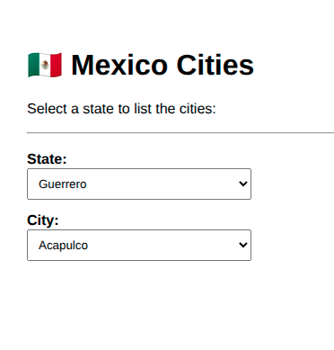

# 🇲🇽 Base de Cidades Mexicanas

**Mexican Cities Database**\
**Base de Ciudades Mexicanas**

---

## 📌 Descrição do Projeto \| Project Description \| Descripción del Proyecto

### 🇧🇷 Português

Aplicação Full Stack completa contendo uma base de dados relacional de
cidades e estados do México. O projeto demonstra a integração entre um
banco MySQL containerizado, uma API robusta em Rails e um frontend
dinâmico em Angular.

### 🇺🇸 English

A complete Full Stack application featuring a relational database of
Mexican cities and states. This project demonstrates the integration of
a containerized MySQL database, a robust Rails API, and a dynamic
Angular frontend.

### 🇪🇸 Español

Aplicación Full Stack completa que contiene una base de datos relacional
de ciudades y estados de México. El proyecto demuestra la integración
entre una base de datos MySQL en contenedores, una API sólida en Rails y
un frontend dinámico en Angular.

---

## 🖼️ Preview



---

## 🛠 Tecnologias \| Technologies \| Tecnologías

- **Backend:** Ruby on Rails 8.1 (API Mode)\
- **Frontend:** Angular 18+, TypeScript, SCSS\
- **Database:** MySQL 8.0 & Docker\
- **Environment:** Linux Mint & rbenv

---

## 🚀 Como Executar \| How to Run \| Cómo Ejecutar

### 1. Database (Docker)

```bash
docker compose up -d
```

### 2. Backend (Rails)

```bash
cd backend
bundle install
bin/rails s -b 0.0.0.0
```

### 3. Frontend (Angular)

```bash
cd frontend
npm install
npm start
```

---

## 🎯 Objetivo \| Goal \| Objetivo

### 🇧🇷 Português

Fornecer uma base estruturada para aprendizado de bancos de dados,
desenvolvimento backend/frontend e testes de integração Full Stack.

### 🇺🇸 English

Provide a structured base for database learning, backend/frontend
development, and Full Stack integration testing.

### 🇪🇸 Español

Proveer una base estructurada para el aprendizaje de bases de datos,
desarrollo backend/frontend y pruebas de integración Full Stack.

---

## 👨‍💻 Author

**Bruno Ramos**\
Backend Developer \| Python \| Ruby on Rails \| Angular \| SQL

🌐 [brunoramos.tec.br](www.brunoramos.tec.br)
